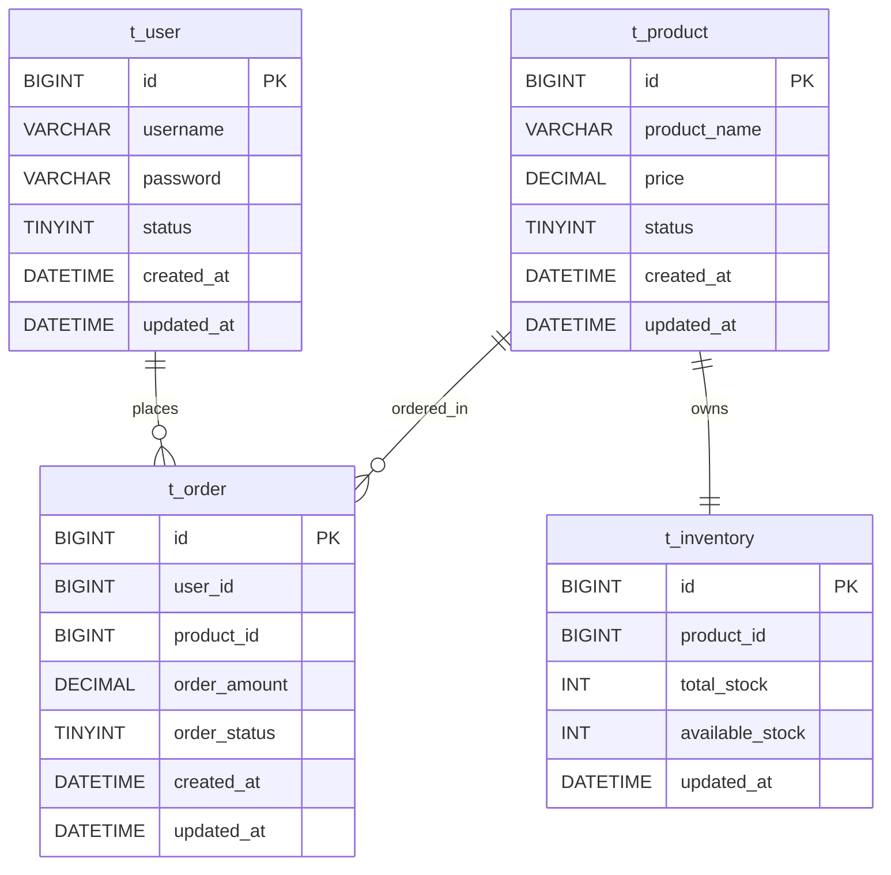

# 系统架构文档

## 1. 设计说明

当前阶段仅保留最基础的架构骨架，不展开具体业务实现。整体采用精简版 DDD，即：

- 按业务领域划分模块
- 每个模块只保留最基础分层
- 不引入重型 DDD 概念
- 不拆分为微服务

推荐形态为：

`模块化单体 + RESTful 接口 + 精简版 DDD`

## 2. 目录结构

目录只保留后续扩展所需的最简骨架：

```text
src/main/java/io/github/resonxu/seckill/
├─ SeckillApplication.java
├─ common/
├─ config/
├─ user/
│  ├─ interfaces/
│  ├─ application/
│  ├─ domain/
│  └─ infrastructure/
├─ product/
│  ├─ interfaces/
│  ├─ application/
│  ├─ domain/
│  └─ infrastructure/
├─ inventory/
│  ├─ interfaces/
│  ├─ application/
│  ├─ domain/
│  └─ infrastructure/
└─ order/
   ├─ interfaces/
   ├─ application/
   ├─ domain/
   └─ infrastructure/

src/main/resources/
├─ application.yml
└─ mapper/
```

说明：

- `interfaces`：接口层
- `application`：应用服务层
- `domain`：领域层
- `infrastructure`：基础设施层

当前阶段不再继续细分子目录，后续需要时再增量补充。

## 3. 数据库表设计

当前仅保留四张核心表：

- `t_user`
- `t_product`
- `t_inventory`
- `t_order`

设计原则：

- 表名前缀统一使用 `t_`
- 表结构保持简单
- 优先满足当前设计说明
- 后续通过新增字段或新增表增量扩展
- 当前默认关系型数据库采用 MySQL

### 3.1 表说明

#### t_user

- 用户基础信息表
- 当前阶段主要服务于登录能力

#### t_product

- 商品基础信息表
- 当前阶段仅保留基础商品字段

#### t_inventory

- 库存基础信息表
- 当前阶段仅保留最基本库存字段

#### t_order

- 订单基础信息表
- 当前阶段仅保留最基本订单字段

## 4. ER 图



## 5. 当前阶段接口约束

虽然系统整体保留用户、商品、库存、订单四个模块，但当前接口层只设计用户登录接口，其它接口后续再补充。

## 6. 专项设计文档

秒杀下单专项方案详见：

- `docs/seckill-order-design.md`
