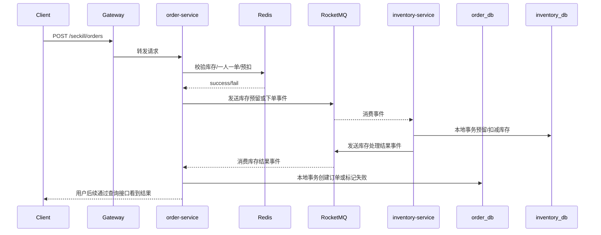
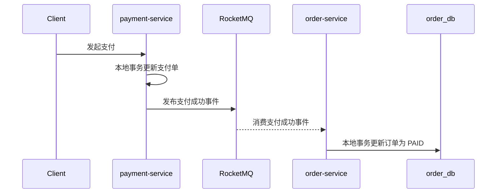

# 微服务演进架构方案

## 1. 文档目的

本文档用于说明当前仓库如果从“模块化单体”继续演进到“独立微服务”形态，整体架构会如何调整，以及推荐采用什么样的服务边界、一致性方案和演进路径。

本文档是未来态设计，不替代当前的单体实现说明。

## 2. 演进目标

从当前形态：

`模块化单体 + Redis + RocketMQ + MySQL`

逐步演进为：

`独立微服务 + Redis 热路径 + RocketMQ 事件驱动 + 多库最终一致性`

演进后的核心目标：

- 每个核心业务域独立部署
- 每个服务独立管理自己的数据库
- 不再通过跨库本地事务保证一致性
- 使用消息驱动和补偿机制保证最终一致性
- 支撑秒杀高并发流量和后续支付场景扩展

## 3. 目标服务拆分

推荐拆分为以下服务：

### 3.1 gateway-service

职责：

- 统一 API 入口
- JWT 鉴权透传
- 限流与黑名单拦截
- 路由转发
- 统一请求追踪头注入

### 3.2 user-service

职责：

- 用户注册与登录
- 用户身份校验
- 用户秒杀资格校验
- 用户维度限购规则管理

数据库建议：

- `user_db`

### 3.3 product-service

职责：

- 商品基础信息管理
- 商品状态管理
- 秒杀活动元信息管理
- 商品详情查询

数据库建议：

- `product_db`

### 3.4 inventory-service

职责：

- 库存真相维护
- 库存预留
- 库存确认扣减
- 库存释放与补偿
- 库存流水审计

数据库建议：

- `inventory_db`

### 3.5 order-service

职责：

- 秒杀请求受理
- 订单创建
- 订单状态流转
- 订单查询
- 订单关闭与失败标记

数据库建议：

- `order_db`

### 3.6 payment-service

职责：

- 支付单创建
- 支付回调处理
- 支付状态推进
- 支付结果事件发布

数据库建议：

- `payment_db`

## 4. 服务边界原则

微服务拆分后必须明确以下规则：

- `order-service` 不能直接写 `inventory-service` 的库存表
- `inventory-service` 不能直接写 `order-service` 的订单表
- 每个服务只能通过本服务数据库事务保证内部一致性
- 跨服务一致性必须通过 RocketMQ 事件、状态机和补偿来保证
- Redis 只承担热路径和缓存职责，不承担最终真相职责

这意味着系统从“单库内事务思维”切换为“服务边界内事务 + 服务边界间最终一致性”。

## 5. 数据库拆分建议

### 5.1 order_db

建议保留：

- `t_order`
- `t_order_operation_log`
- `t_mq_consume_record`
- `t_outbox_event`

说明：

- `t_order` 保存订单主数据
- `t_mq_consume_record` 保存 MQ 消费幂等记录
- `t_outbox_event` 用于本地消息表模式扩展

### 5.2 inventory_db

建议保留：

- `t_inventory`
- `t_inventory_flow`
- `t_inventory_reservation`
- `t_mq_consume_record`

说明：

- `t_inventory` 保存库存真相
- `t_inventory_reservation` 记录库存预留与确认状态
- `t_inventory_flow` 用于库存审计和排障

### 5.3 product_db

建议保留：

- `t_product`
- `t_seckill_activity`
- `t_seckill_activity_product`

### 5.4 user_db

建议保留：

- `t_user`
- `t_user_purchase_limit`

### 5.5 payment_db

建议保留：

- `t_payment_order`
- `t_payment_callback_record`
- `t_mq_consume_record`

## 6. Redis 与 RocketMQ 的定位

### 6.1 Redis 定位

Redis 主要承担以下职责：

- 秒杀库存热数据
- 一人一单占位
- 用户限购标记
- 限流计数器
- 商品详情热点缓存

Redis 不负责：

- 最终库存真相
- 最终订单真相
- 长期可靠事务状态

### 6.2 RocketMQ 定位

RocketMQ 主要承担以下职责：

- 秒杀请求削峰
- 订单与库存跨服务事件传递
- 支付结果事件传递
- 失败补偿驱动
- 延迟关闭订单

建议 Topic 规划：

- `seckill-order-submit`
- `inventory-reserve`
- `inventory-reserve-result`
- `order-create`
- `order-cancel`
- `payment-success`
- `payment-failed`
- `inventory-release`

## 7. 订单与库存一致性方案

推荐优先采用：

`Redis 预扣 + RocketMQ 事件驱动 + 本地事务 + 补偿`

而不是直接上 TCC。

原因：

- 与当前项目现有技术栈更贴近
- 实现复杂度可控
- 更适合课程设计和逐步演进
- 能满足秒杀场景“高并发 + 最终一致性”的核心目标

## 8. 秒杀下单主链路

### 8.1 推荐主时序



### 8.2 关键说明

- 同步接口只返回“已受理”
- 订单是否创建成功通过异步状态推进确定
- 库存服务是库存最终真相
- 订单服务是订单最终真相
- 任意失败路径必须支持重试或补偿

## 9. 支付与订单状态一致性方案

支付场景不建议由 `order-service` 直接调用数据库强改支付状态，而应通过支付事件驱动：

### 9.1 推荐主时序



### 9.2 关键说明

- 支付服务只维护支付结果
- 订单服务只维护订单状态
- 双方通过事件衔接，不做跨库事务
- 若订单更新失败，必须可重试消费

## 10. 状态机设计建议

### 10.1 订单状态

建议至少包含：

- `PENDING`
- `STOCK_RESERVING`
- `CREATED`
- `FAILED`
- `PAYING`
- `PAID`
- `CANCELLED`

### 10.2 库存预留状态

建议至少包含：

- `INIT`
- `RESERVED`
- `CONFIRMED`
- `RELEASED`
- `FAILED`

### 10.3 支付状态

建议至少包含：

- `INIT`
- `PROCESSING`
- `SUCCESS`
- `FAILED`
- `CLOSED`

## 11. 推荐一致性实现方式

### 11.1 第一阶段

优先实现：

- Redis 原子预扣
- RocketMQ 异步事件
- 消费幂等表
- 本地事务扣库存/落订单
- 失败补偿回滚 Redis 占位

### 11.2 第二阶段

补齐：

- 本地消息表 `Outbox`
- 延迟消息关闭超时订单
- 库存释放流程
- 失败订单重试与人工修复入口

### 11.3 第三阶段

如果需要更强事务编排，再评估：

- TCC
- Seata
- Saga 编排

当前项目不建议一开始就引入 TCC 或 Seata，否则复杂度会明显超过当前仓库收益。

## 12. 推荐工程目录

如果未来正式拆分仓库或多模块，可采用如下结构：

```text
services/
  gateway-service/
  user-service/
  product-service/
  inventory-service/
  order-service/
  payment-service/
common/
  common-core/
  common-security/
  common-mq/
  common-redis/
deploy/
  mysql/
  redis/
  rocketmq/
docs/
```

如果仍保留单仓库多模块 Maven 结构，可进一步演进为：

```text
pom.xml
services/
  gateway-service/
  user-service/
  product-service/
  inventory-service/
  order-service/
  payment-service/
libraries/
  common-core/
  common-web/
  common-mq/
  common-security/
```

## 13. 从当前项目的演进步骤

推荐按以下顺序推进，而不是一步拆完：

### 13.1 第一步：补齐单体内最终一致性

先在当前仓库内补齐：

- 下单消息消费闭环
- 订单查询接口
- 失败补偿链路
- 订单状态机
- 支付成功后的订单更新链路

### 13.2 第二步：逻辑边界硬隔离

在单体内先做到：

- `order` 不直接依赖 `inventory` 持久化实现
- 服务间只通过应用层接口或事件模型交互
- 明确 DTO、事件对象和领域边界

### 13.3 第三步：拆分独立数据库

优先拆：

- `order_db`
- `inventory_db`

因为秒杀一致性的核心矛盾就在这两个域之间。

### 13.4 第四步：拆分独立服务

拆分顺序建议：

1. `inventory-service`
2. `order-service`
3. `gateway-service`
4. `payment-service`
5. 其余服务

### 13.5 第五步：补齐分布式治理能力

包括：

- 配置中心
- 服务注册发现
- 链路追踪
- 指标监控
- 日志聚合
- 限流与熔断

## 14. 关键风险

演进到微服务后，需要重点关注：

- Redis 预扣和数据库真相漂移
- MQ 重复消费导致重复订单
- 库存事件乱序导致状态覆盖
- 订单失败但库存未释放
- 支付成功事件重复投递
- 服务间接口变更导致契约不兼容

因此必须落实：

- 幂等
- 去重
- 状态机校验
- 重试
- 补偿
- 审计流水

## 15. 结论

如果项目往独立微服务演进，最终会从：

`模块内方法调用 + 单库事务`

转变为：

`服务间事件通信 + 多库最终一致性`

在本项目场景下，最务实的目标架构是：

`gateway + user + product + inventory + order + payment + Redis + RocketMQ`

最适合当前仓库的实施路线是：

1. 先把当前单体内的秒杀一致性闭环补完整
2. 再硬化订单与库存边界
3. 然后拆库
4. 最后拆服务

这样风险最低，也最符合当前代码基础。
